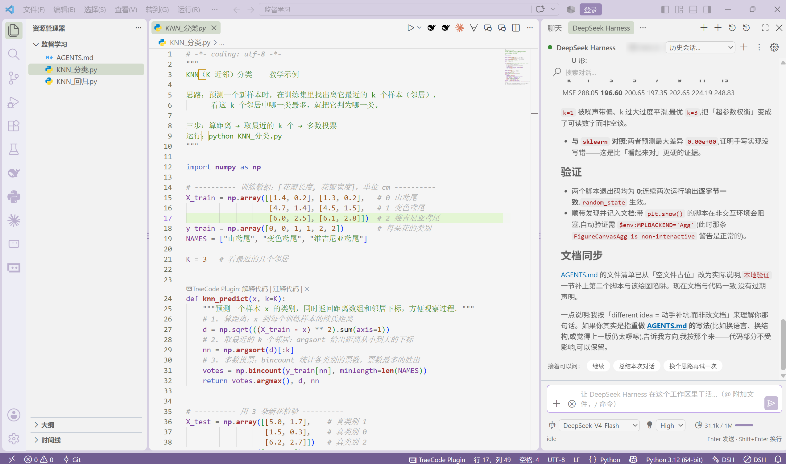

# DeepSeek Harness for VS Code

AI coding agent for VS Code powered by the [official open-source DeepSeek Harness (`dsh`)](https://github.com/deepseek-ai/deepseek-harness), integrated over the [Agent Client Protocol (ACP)](https://agentclientprotocol.com).

The extension is a thin, deeply-integrated shell around the dsh kernel - the same philosophy as Kimi Code for VS Code: the extension renders, reviews and approves; the kernel plans, edits and runs.



The panel lives in the **secondary side bar on the right**, so your editor stays where it is. Below the composer are the model, reasoning effort and context occupancy (shown here: `DeepSeek-V4-Flash` / `High` / `31.1k / 1M`).

## Highlights

- Copilot-style sidebar chat panel that follows your VS Code theme (all colors from `--vscode-*` variables)
- `@` file attachments and selection context, `/init` `/compact` `/login` slash commands
- Multi-file agent edits reviewed in the **native VS Code diff editor** with per-file Accept / Reject / Keep all (working set)
- Permission requests surfaced as approval cards plus native notifications
- Tool-call timeline, plan/todo progress, thinking blocks, streaming markdown with code copy / insert-into-editor
- Sessions history per workspace, resumable when the kernel supports it
- API key stored in VS Code SecretStorage; kernel config shared with the `dsh` CLI

## Repository layout

| Path | Purpose |
| --- | --- |
| `packages/core` | Wire protocol, domain models, pure timeline reducer (unit tested) |
| `packages/extension` | VS Code extension host: ACP backend, session service, diff review, approvals |
| `packages/webview-ui` | React chat panel bundled with Vite |
| `docs/` | Architecture, testing, release handbook |

## Getting started (development)

Prerequisites: Node.js >= 20 and pnpm >= 10.

```bash
pnpm install
pnpm build
```

Then open this folder in VS Code and press `F5` ("Run DeepSeek Harness extension").

The kernel itself is **not** bundled. On first use you are guided to either install it globally (`npm i -g @deepseek-ai/dsh`) or run **DeepSeek Harness: Install Kernel** from the command palette (managed install into extension storage).

## Testing and quality gates

```bash
pnpm typecheck   # strict TypeScript across all packages
pnpm lint        # eslint (typescript-eslint + prettier)
pnpm test        # vitest: reducer unit tests + ACP integration tests
pnpm package     # production build + vsce package
```

## Publishing

See `docs/release.md` for the marketplace checklist (publisher, PAT, VSIX, review compliance).

## License

MIT - see [LICENSE](./LICENSE). The dsh kernel is licensed MIT by DeepSeek AI; ACP SDK by Zed Industries (Apache-2.0).
