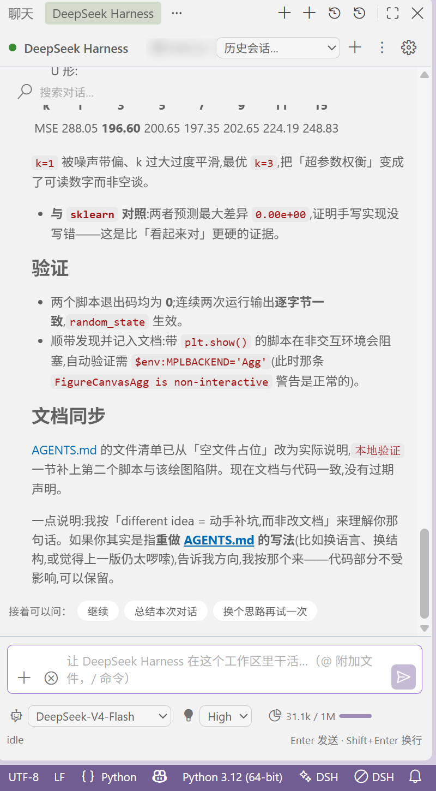

# DeepSeek Harness for VS Code

AI 编码代理，由官方开源 **DeepSeek Harness（dsh）** 内核驱动，经 Agent Client Protocol 接入 VS Code。界面中英双语，中文为主（跟随 VS Code 显示语言自动切换）。

面板在**右侧辅助侧边栏**，编辑器留在原位——底部是输入框，输入框下方依次是模型、推理挡位与上下文占用（图中为 `DeepSeek-V4-Flash` / `High` / `31.1k / 1M`）。

## What it does

- **Chat that knows your workspace** - `@`-mention files（已打开的优先）, attach the current selection, drag & drop 文件，或让代理自主探索
- **Agent mode with full review** - multi-file edits open in the native VS Code diff viewer; accept or reject per file / keep all / review one by one（diff 视图标题栏也有 ✓/✕）
- **Approvals you control** - every shell command needs your approval (allow once / always for this session / deny)
- **Live timeline** - tool calls, plans and thinking stream in as collapsible cards，工具带中文类型徽标
- **Native look** - the panel uses your exact theme colors, fonts and icons; light, dark and high-contrast all just work
- **中英双语，中文为主** - 界面文案跟随 VS Code 显示语言（默认中文，可切换英文）

## Requirements

- The `dsh` kernel **0.1.2+** (developer preview): install with `npm install -g @deepseek-ai/dsh`, or run **DeepSeek Harness: Install Kernel** from the command palette. The extension automatically creates the `acp` kernel profile and installs the version-paired `@deepseek-ai/dsh-acp-app` plugin on first use.
- A DeepSeek API key or provider configured in your dsh home (shared with the `dsh` CLI): use `/login` or **DeepSeek Harness: Set API Key**

## Getting started

1. Install the extension
2. Click the whale icon in the Activity Bar（或按 `Ctrl+Alt+D`）
3. Run `/login` in the chat, or set your API key via the command palette
4. 试试空状态"快速开始"卡，或选中代码后点灯泡

## Commands

| 命令 | 快捷键 |
| --- | --- |
| `打开对话` | `Ctrl+Alt+D` |
| `新对话` | `Ctrl+Alt+N` |
| `逐个审查变更` | `Ctrl+Alt+R` |
| `行内指令编辑选中代码`（Cursor Cmd+K 风格） | `Ctrl+Alt+K` |
| `用 DeepSeek Harness 解释所选代码` | `Ctrl+Alt+E` |
| `用 DeepSeek Harness 重构所选代码` | 编辑器右键 / 灯泡 |
| `用 DeepSeek Harness 解释此问题` | Problems 面板右键 |
| `解释剪贴板报错` | 命令面板 |
| `将文件加入 DeepSeek Harness 对话` | 编辑器标题栏按钮 |
| `生成 Git 提交信息` | SCM 标题栏按钮 / 面板菜单 |
| `导出对话为 Markdown` | 面板菜单 ⋮ |
| `重命名会话` / `删除会话` | 面板菜单 ⋮ |
| `创建项目规则 AGENTS.md` | 命令面板（无文件时自动建议） |
| `快速提问` | 命令面板 |
| `安装内核（dsh）` / `查看日志` / `复制诊断信息` | 命令面板 |
| `设置 / 清除 / 查看 API Key` | 命令面板 |
| `快捷操作菜单` | 点击状态栏图标 |

## Settings

| Setting | Description |
| --- | --- |
| `dsh.executablePath` | 内核入口绝对路径（留空自动探测） |
| `dsh.preferredVersion` | 固定内核版本（如 `0.1.2-rc.1`，预览期建议固定） |
| `dsh.acpArgs` | ACP 服务启动参数（默认 `["--profile", "acp"]`） |
| `dsh.acpProfile` | ACP 使用的内核 profile（按需自动创建） |
| `dsh.acpPluginPackage` | 提供 ACP 的内核插件（与内核版本配对安装） |
| `dsh.homeDir` | 覆盖 dsh 主目录 |
| `dsh.autoApproveReadOnly` | 自动批准只读工具（读/搜/思/抓） |
| `dsh.attachActiveSelection` | 发送时自动附加活动选区（默认开） |
| `dsh.autoOpenReview` | 回合结束自动打开首个待审 diff（默认开） |
| `dsh.selectionHint` | 选中代码后在选区末尾提示快捷键（默认开） |

> 以上设置均支持热重载——修改后立即生效，无需重载窗口。

## Privacy

Your code stays local. The extension spawns the dsh kernel on your machine; only the prompts and file context you send travel to the model provider configured in your dsh installation. API keys live in VS Code SecretStorage and are never written to settings files.

## License

MIT
